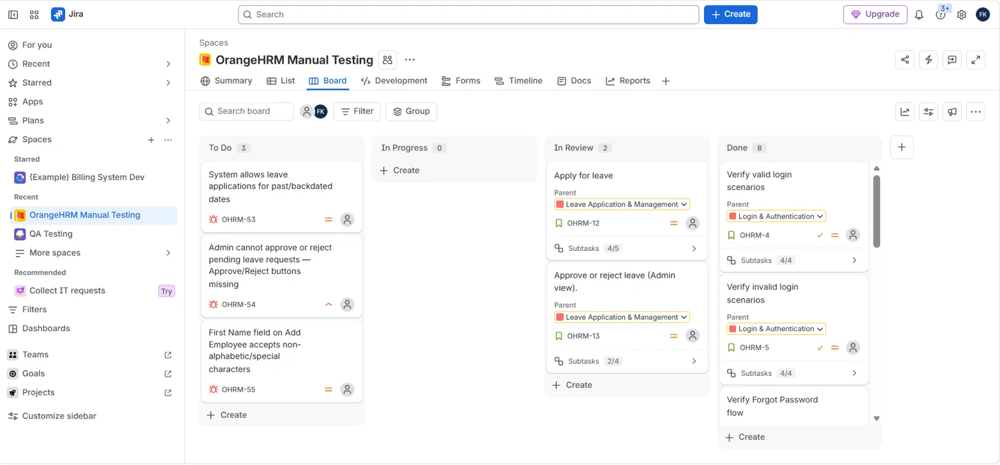
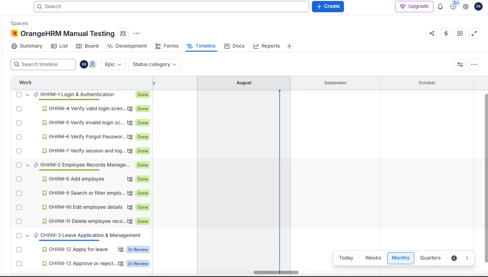
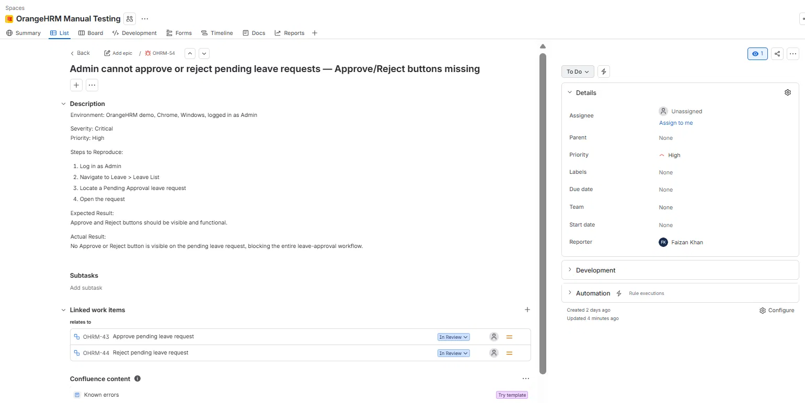
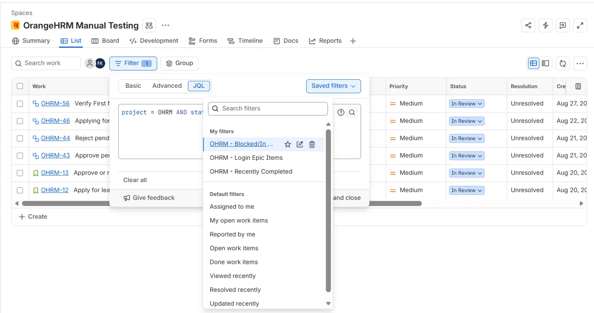
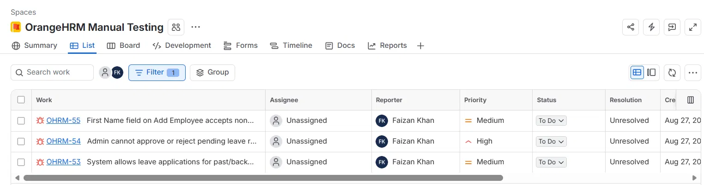

# OrangeHRM Manual QA Testing Project

Manual testing project on the [OrangeHRM demo application](https://opensource-demo.orangehrmlive.com), covering test planning, execution, and defect tracking using Jira.

## Overview

This project simulates a real QA workflow: designing test cases, executing them manually against a live HR management application, tracking work in Jira using an Epic → Story → Sub-task hierarchy, and logging/linking defects found during testing.

**Modules tested:** Login & Authentication, PIM (Employee Records Management), Leave Application & Management

## Tools Used
- **Jira Cloud** — issue tracking, test case-to-task mapping, defect logging, JQL
- **Excel** — structured test case documentation
- **OrangeHRM demo** — application under test

## Test Case Summary

Full test case documentation: [`Test_Cases.xlsx`](./Test_Cases.xlsx)

| Module | Test Cases | Passed | Failed |
|---|---|---|---|
| Login & Authentication | 12 | 11 | 1 (reclassified — not a defect, see notes) |
| PIM | 16 | 15 | 1 |
| Leave | 12 | 10 | 2 |
| **Total** | **34** | **30** | **3 real defects** |

## Jira Project Structure

Organized as 4 Epics → Stories → Sub-tasks, mirroring test scenarios:

- **Login & Authentication** — valid/invalid login, forgot password, session/logout
- **Employee Records Management (PIM)** — add/search/edit/delete employee records
- **Leave Application & Management** — apply for leave, admin approval workflow
- **Recruitment** *(out of scope for this test cycle)*





## Defects Found

| ID | Summary | Severity | Priority | Status |
|---|---|---|---|---|
| OHRM-53 | First Name field on Add Employee accepts non-alphabetic/special characters | Minor | Medium | To Do |
| OHRM-54 | Admin cannot approve or reject pending leave requests — buttons missing | **Critical** | **High** | To Do |
| OHRM-55 | System allows leave applications for past/backdated dates | Major | Medium | To Do |

Each bug follows a consistent report structure (Environment, Severity, Priority, Steps to Reproduce, Expected vs Actual Result) and is linked to the sub-task/test case that surfaced it.



### Note on a reclassified finding
One initial "failure" (back-button after logout briefly showing a cached page) was investigated and reclassified as **not a defect** — it's standard browser bfcache behavior, and the session was confirmed terminated correctly server-side on refresh. Documenting *why* something isn't a bug, not just what is, was treated as part of the QA process here.

## JQL Practice

Three saved filters were built and used to query project state:

```
project = OHRM AND status = "In Review"
project = OHRM AND parent = OHRM-1
project = OHRM AND status = Done ORDER BY updated DESC
```





## Key Takeaways
- Practiced structuring test coverage using Jira's Epic/Story/Sub-task hierarchy
- Distinguished true defects from false positives (browser caching vs. real functional bugs) — and correctly assessed severity/priority for each
- Logged bugs using a consistent, reusable report template
- Linked defects bidirectionally to the test cases that found them for full traceability
- Practiced JQL for filtering and querying project state

---
*Live Jira board is a personal instance and not publicly accessible; screenshots above document the completed state.*
